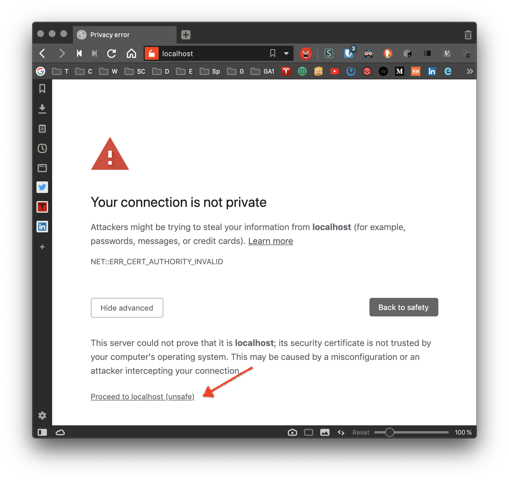

# k8-local-nginx-ingress-tls
Local Kubernetes Hello World example with Nginx Ingress, Helm, Cert Manager, and Let's Encrypt TLS

## Quick Start

* Ensure you have local Kubernetes running

* Install helm `brew install kubernetes-helm`

* Run installer `./install.sh`

* Open http://localhost

* Open **Advanced** and **Proceed**

* Confirm `helloworld` loading

## For a detailed blog post on how to use, see:

https://callbackinsanity.com/local-kubernetes/
